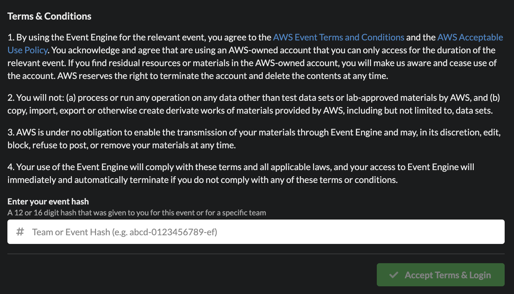
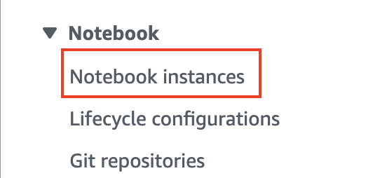
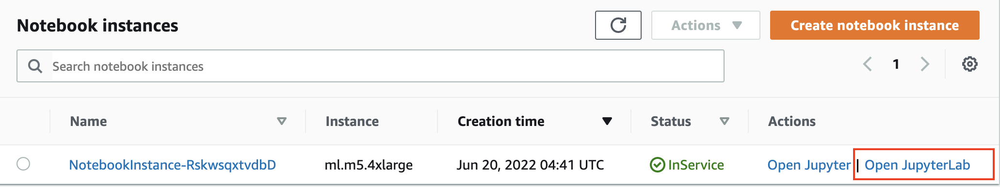
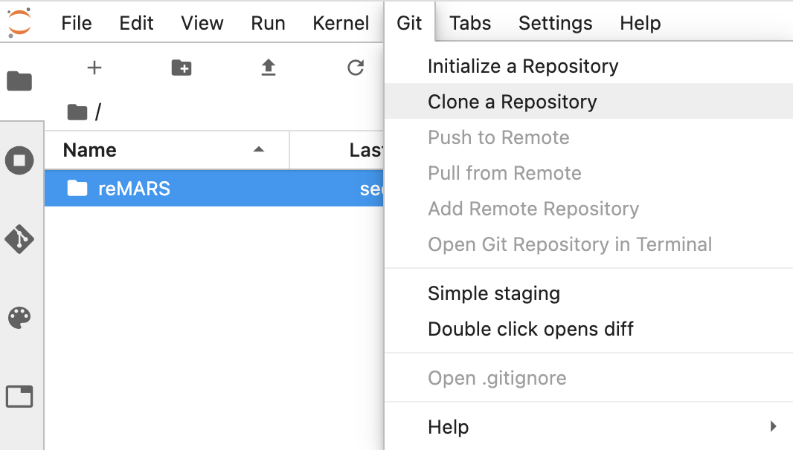
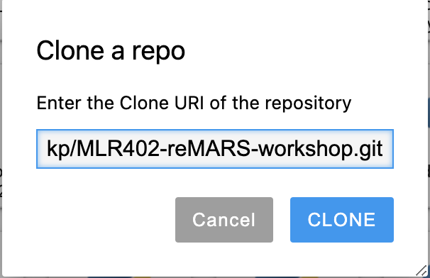
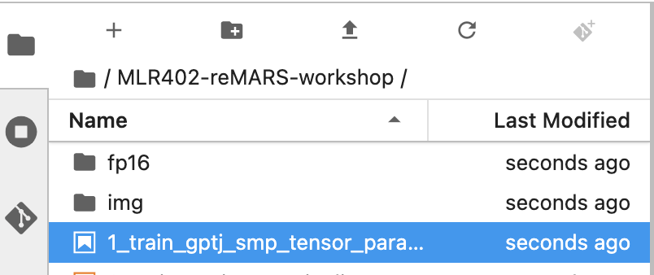

# Getting Started with MLR402 re:MARS workshop

## Open https://dashboard.eventengine.run/login and enter your assigned event hash in the text box as shown in the below screen

## Select "OTP using your email" option to login

## Click on "Open AWS Console" button in order to login to your AWS Account for this workshop

## Open "Amazon SageMaker" from AWS Console

## Click on "Notebook instance" under Notebook on the Amazon SageMaker Home page

## You will see a pre-created Notebook instance. Click on "Open JupyterLab" as shown below

## You will see JupyterLab User interface. Go to Git -> Clone a Repository option from the Main menu as shown below

## Enter "https://github.com/dhawalkp/MLR402-reMARS-workshop.git" URL to clone the repo as shown below

## Once the cloning finishes, Go to the folder created with name "MLR402-reMARS-workshop". Click on "1_train_gptj_smp_tensor_parallel.ipynb" notebook and follow the instructions in this notebook

